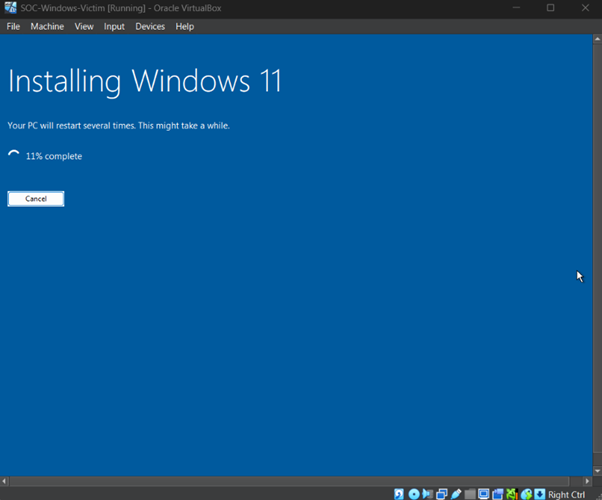
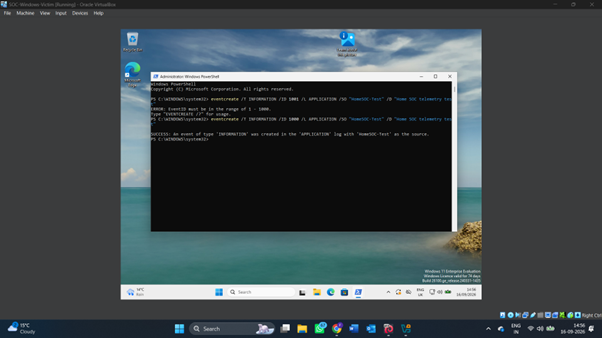
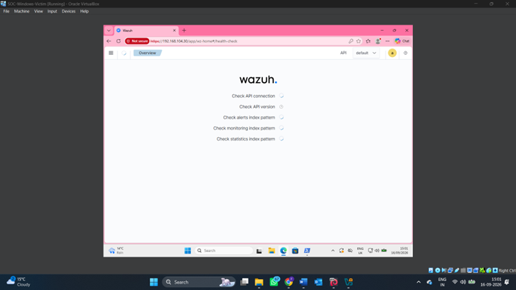
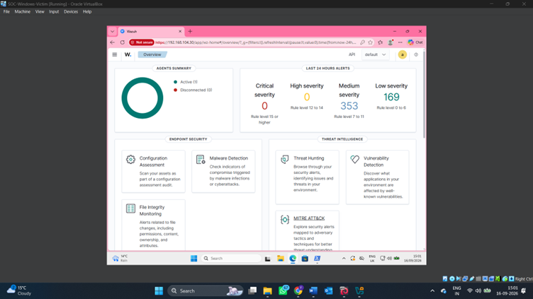
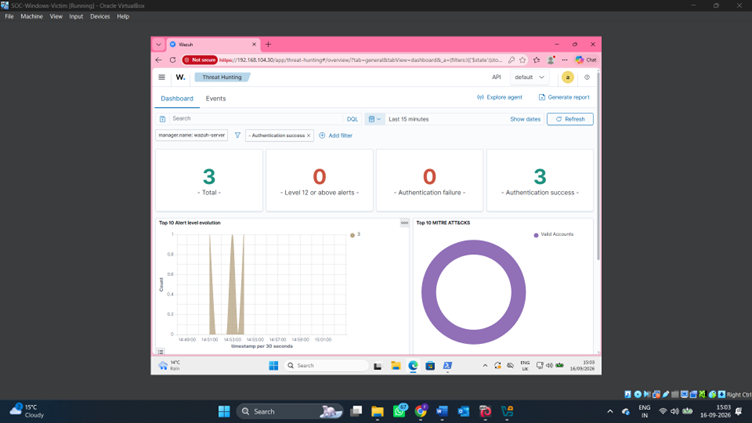

# 🔧 Installation Guide

## Overview

This guide covers the setup of the virtual SOC environment using VirtualBox, Windows 11, Kali Linux, Wazuh and Sysmon.

## 1. Virtual Machines

The lab consists of three virtual machines:

| VM | Role |
|---|---|
| Windows 11 | Monitored endpoint |
| Kali Linux | Security testing machine |
| Wazuh | SIEM and security monitoring |

VirtualBox was used to create and manage the virtual machines.

## 2. Network Configuration

The Windows and Kali machines were connected through an isolated Host-Only network.

The lab network used:

**Network:** `192.168.104.0/24`

**Windows 11:** `192.168.104.10`

**Kali Linux:** `192.168.104.20`

The Windows machine also retained NAT connectivity for internet access.

## 3. Windows Endpoint

Windows 11 was configured as the monitored endpoint.

The system was prepared for security monitoring and endpoint telemetry collection.

## 4. Sysmon

Sysmon was installed on the Windows endpoint to provide additional system and process telemetry.

The collected telemetry was used during the monitoring and investigation stages of the lab.

## 5. Wazuh

Wazuh was deployed as the central security monitoring platform.

The Wazuh interface was used to monitor the Windows endpoint and review security events.

## 6. Wazuh Agent

The Wazuh Agent was configured on the Windows endpoint to send relevant security information to the Wazuh environment.

Connectivity between the endpoint and Wazuh was verified before continuing with monitoring and investigation.

## 7. Verification

The completed environment allowed endpoint activity to be collected and reviewed through Wazuh.

The Threat Hunting interface was then used to examine the collected events.

## Lab Architecture

The lab followed this general architecture:

**Kali Linux → Windows 11 Endpoint → Wazuh**

- Kali Linux: security testing environment
- Windows 11: monitored endpoint
- Sysmon: endpoint telemetry
- Wazuh Agent: telemetry collection
- Wazuh: security monitoring and analysis

## Result

The completed setup provided a controlled environment for monitoring Windows endpoint activity, reviewing security events and practising threat hunting and investigation.
