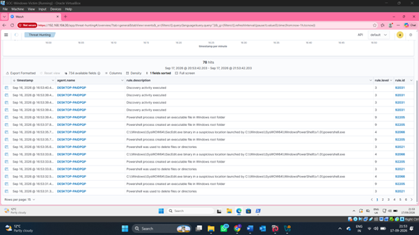

# 🔎 Security Event Investigation

## Overview

The lab was used to investigate security activity recorded from the Windows endpoint through Wazuh.

The investigation involved reviewing security events, using Threat Hunting to identify relevant activity, and examining individual events.

## 1. Review Security Events

Security events collected from the Windows endpoint were reviewed through the Wazuh event interface.

## 2. Examine Event Details

Individual events were opened to review their recorded information and metadata.

## 3. Review Endpoint Activity

Windows command-line activity was observed during the lab and reviewed as part of the investigation process.

## 4. Threat Hunting

The Threat Hunting interface was used to search and review security activity collected from the Windows endpoint.

## 5. Analyse Individual Events

Additional event information was examined through the Wazuh Document Details view.

## 6. Review Event Activity

The event log was reviewed to examine recorded security activity within the monitored environment.

## Investigation Workflow

**Identify Activity → Review Event → Examine Details → Analyse Telemetry → Investigate**

## Key Skills

- Security event investigation
- Threat hunting
- SIEM analysis
- Windows event analysis
- Endpoint telemetry
- Event metadata analysis
