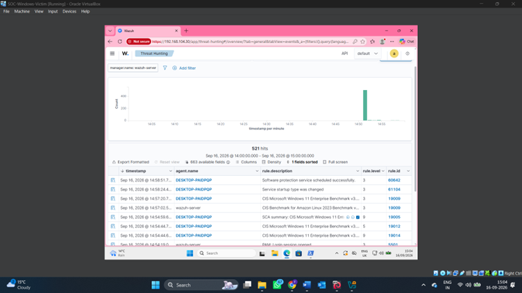
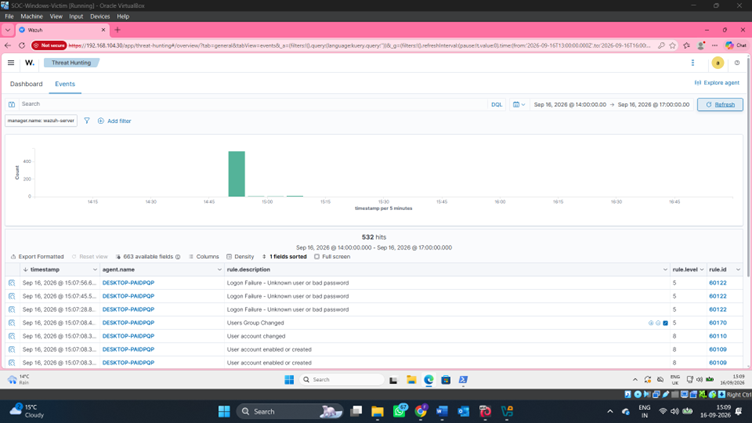
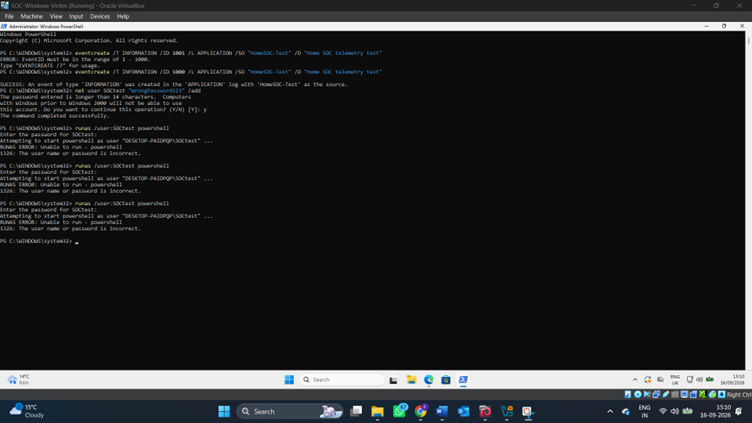

# 🔍 Monitoring & Detection

## Overview

Wazuh was used as the central security monitoring platform for the lab.

The Windows endpoint generated security telemetry that was collected and reviewed through Wazuh.

## Wazuh Dashboard

The Wazuh dashboard provided an overview of the monitored environment and security activity.

## Threat Hunting

The Threat Hunting interface was used to search and review security events collected from the Windows endpoint.

## Security Events

Security events recorded from the Windows environment were reviewed through the Wazuh event interface.

## Windows Event Monitoring

The lab included investigation of Windows security events, including Windows Filtering Platform Event ID 5157.

Event ID 5157 represents a connection that was blocked by Windows Filtering Platform.

The event was reviewed through Wazuh as part of the monitoring and investigation process.

## Endpoint Activity

Command-line activity on the Windows endpoint was also reviewed as part of the lab.

## Detection Workflow

The monitoring process followed this workflow:

**Windows Endpoint → Security Telemetry → Wazuh → Security Events → Threat Hunting → Investigation**

## Skills Demonstrated

- SIEM monitoring
- Endpoint monitoring
- Security event analysis
- Threat hunting
- Windows security telemetry
- Event investigation
