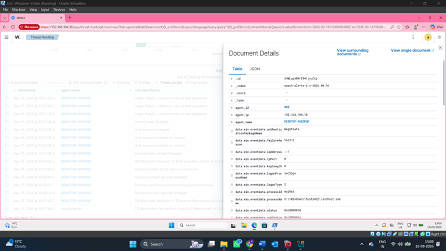
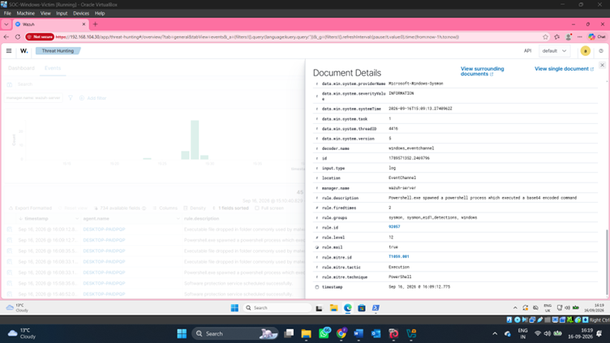
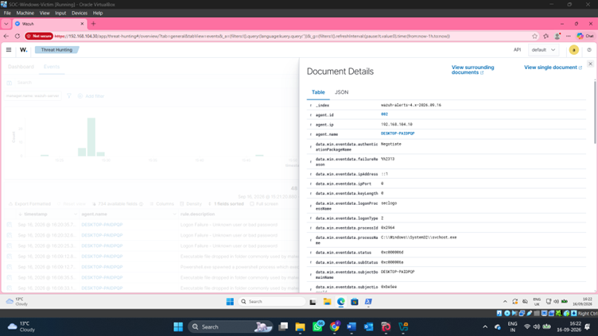
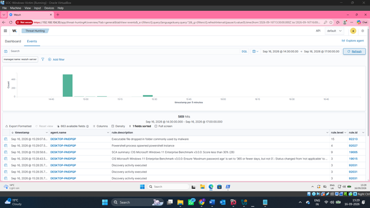

# 🛡️ Wazuh Rules & Events

## Overview

Wazuh was used to collect, monitor and analyse security events generated by the Windows endpoint.

The lab included the investigation of Windows security events through the Wazuh interface.

## Windows Event ID 5157

One of the events investigated during the lab was **Event ID 5157**.

This event relates to Windows Filtering Platform activity where a network connection was blocked.

The event was reviewed through Wazuh to examine the recorded security information and understand the activity observed on the Windows endpoint.

## Event Investigation

The Wazuh event interface was used to locate security events and examine their details.

## Event Details

Individual events were opened in Wazuh to review the available event information and metadata.

## Threat Hunting

The Threat Hunting interface was used to review collected security activity and investigate events of interest.

## Detection Workflow

**Windows Security Event → Wazuh Agent → Wazuh → Event Analysis → Threat Hunting → Investigation**

## Key Concepts

- Windows security event monitoring
- Windows Filtering Platform events
- Event ID analysis
- SIEM monitoring
- Threat hunting
- Security event investigation
- Endpoint telemetry analysis
